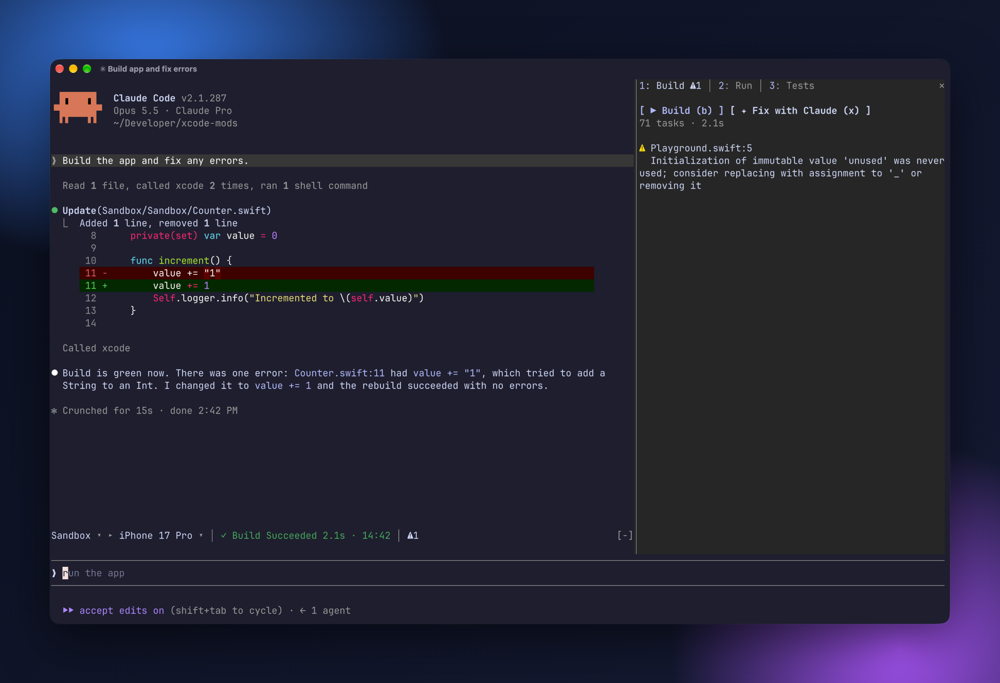
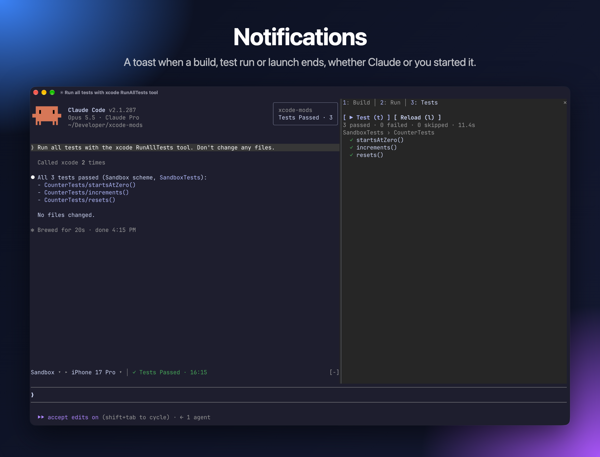
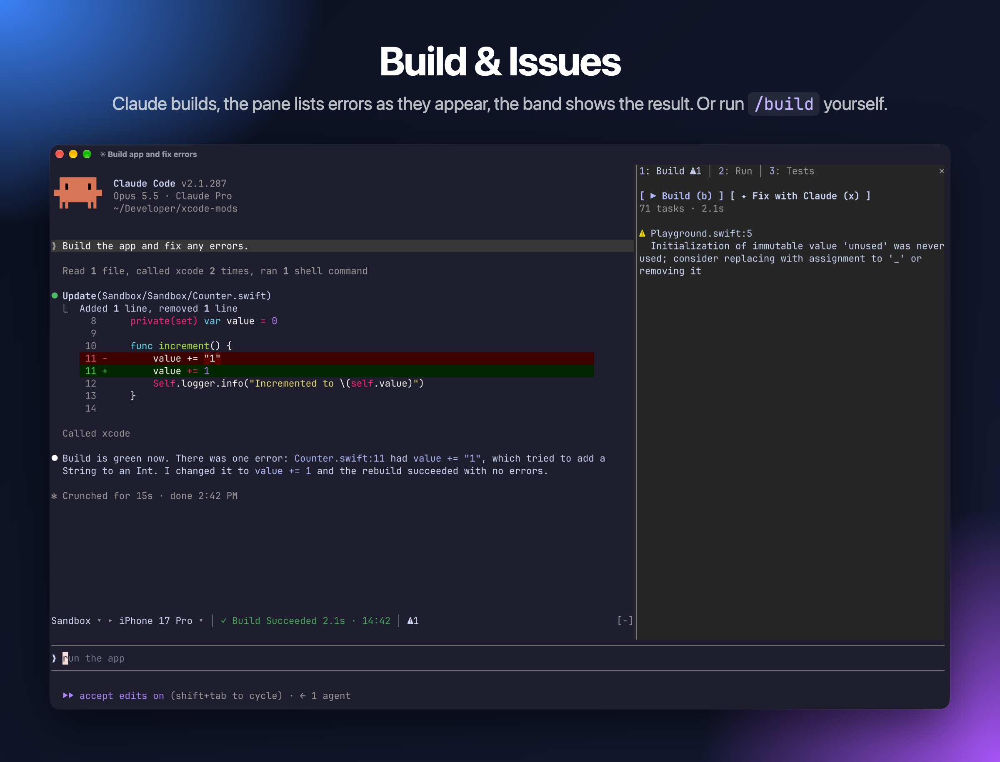
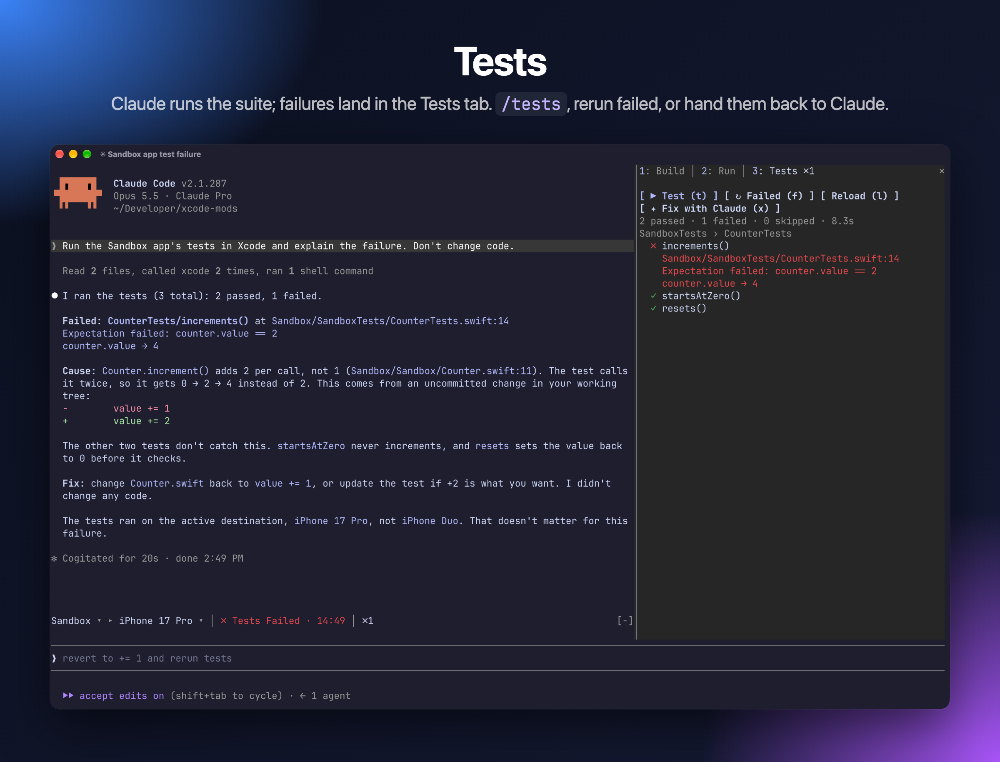
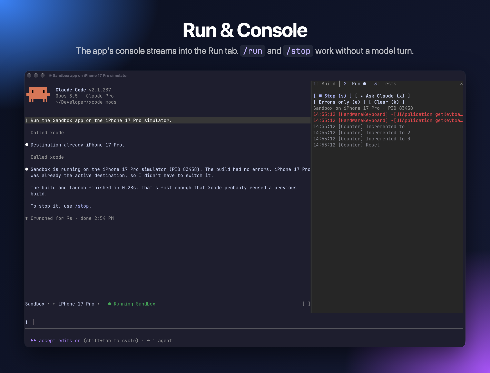
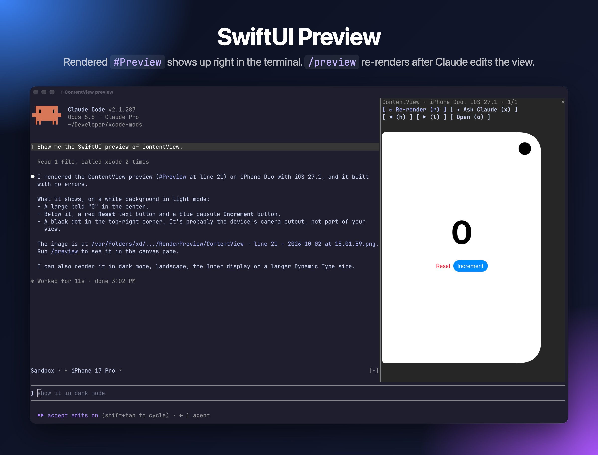

# xcode-mods

Xcode's build, tests, console and SwiftUI previews inside [Claude Code](https://claude.com/claude-code), built on the headless Xcode MCP server.



One Claude Code plugin that adds:

- a toolbar band above the prompt (scheme ▸ destination, activity, problem counters);
- an **Xcode** pane with **Build · Run · Tests** tabs;
- a **Canvas** pane that shows SwiftUI `#Preview` snapshots.

It picks up Claude's own Xcode tool calls too. When Claude builds, runs tests, launches the app or renders a preview, the result appears in the pane.

## Requirements

- Xcode 27 or later with the MCP server in headless mode
- Claude Code 2.1.286 or later (mods support)
- To see previews in the terminal: a terminal with the kitty graphics protocol, such as [Ghostty](https://ghostty.org). The Claude desktop app works too.

## Setup

1. Turn on Xcode's headless MCP server (once):

   ```sh
   sudo xcrun mcp-server enable
   xcrun mcp-server status
   ```

2. Add the server to Claude Code. The mods expect it to be named `xcode`:

   ```sh
   claude mcp add --scope user xcode -- xcrun mcpbridge
   ```

3. Allow the mods' Xcode calls in `~/.claude/settings.json`. Without this rule, every build or refresh asks for permission:

   ```json
   {
     "permissions": {
       "allow": ["mcp__xcode"]
     }
   }
   ```

4. Install the plugin:

   ```
   /plugin marketplace add artemnovichkov/xcode-mods
   /plugin install xcode-mods@xcode-mods
   ```

Open Claude Code in a folder with an `.xcodeproj` or `.xcworkspace` (up to 3 levels deep). The band appears above the prompt. In other folders the plugin stays hidden and don't register any commands.

## Usage

| Command | What it does |
| --- | --- |
| `/xcode` | Open the Xcode pane |
| `/build` | Build the active scheme |
| `/tests [filter]` | Run all tests, or only those whose `Target/identifier` contains the filter |
| `/run` | Build and run on the active destination, then stream the console |
| `/stop` | Stop the running app |
| `/preview [file.swift]` | Render a `#Preview` into the Canvas pane. Without an argument, uses `ContentView.swift`, or the first file with `#Preview`. |

### Toolbar band

The band above the prompt works like Xcode's toolbar:

```
 Sandbox ▸ iPhone 17 Pro │ ✓ Build Succeeded 1.4s · 14:02 │ ⚠1 ✗2
```

- **Scheme ▸ destination.** Pickers; a change switches them in Xcode too.
- **Activity.** What runs now (`◐ Building 3s · Compile ContentView.swift`, `◐ Testing`, `◐ Launching`, `● Running Sandbox`), or the last result with its time (`✓ Build Succeeded`, `✗ Tests Failed`, `■ Sandbox stopped`).
- **Counters.** `⛔` errors, `⚠` warnings, `✗` failed tests. Click one to open the matching tab.

The band also shows Claude's own builds, test runs and launches.

### Notifications



A toast pops up in the top right corner when an action ends, whether you or Claude started it:

- `Build Succeeded · 2 warnings`, `Build Failed · 3 errors`
- `Tests Passed · 12`, `Tests Failed · 2 failed`
- `Run Failed`
- `Preview ready: /preview to show`, when the window is too narrow to open the Canvas pane by itself

### Build & Issues



Live progress while the build runs, then errors and warnings. Click a file name to open that line in Xcode.

Keys: `b` build · `x` send the issues to Claude to fix

### Tests



Tests are grouped by target and suite, with failures first and their messages shown inline. Click a test to run only that test.

Keys: `t` run all · `f` rerun failed · `l` reload the list · `x` ask Claude to fix the failures

### Run & Console



The app's stdout and OSLog stream in while it runs.

Keys: `r` run · `s` stop · `e` errors only · `k` clear · `x` ask Claude about the console

### SwiftUI Preview



Keeps the last 10 snapshots. Once you have rendered a preview, it re-renders after Claude edits a Swift file that contains `#Preview`.

Keys: `r` re-render · `h`/`l` previous/next · `o` open the PNG · `x` ask Claude to review the layout

Switch tabs with `1` `2` `3`.

## Troubleshooting

- **The band says `Xcode MCP server "xcode" not connected`.** Run `/mcp` and check that the `xcode` server is connected. Check that `xcrun mcp-server status` reports it as enabled.
- **Every action asks for permission.** Add the `mcp__xcode` allow rule from Setup.
- **The first preview takes a minute or more.** Xcode builds the preview host on the first render. Later renders are fast.
- **The preview always renders on the same simulator.** Xcode picks the preview device itself, and the MCP server doesn't let you choose it yet.
- **No image in the Canvas pane.** Your terminal doesn't support the kitty graphics protocol. The pane shows the PNG path instead; press `o` to open it.

## Development

```
mods/xcode-mods/hooks/register.tsx   # entry: wires both modules
mods/xcode-mods/hooks/build.tsx      # toolbar band + Build · Run · Tests pane
mods/xcode-mods/hooks/canvas.tsx     # SwiftUI preview pane
Sandbox/                             # test iOS app (XcodeGen: project.yml)
.mcp.json                            # xcode MCP server for this repo
```

To run the plugin from source with hot reload:

```sh
claude --plugin-dir mods/xcode-mods
```

Claude Code writes the mod API types into `mods/xcode-mods/.claude-plugin/types/` (git-ignored) when it loads the plugin with `--plugin-dir`, so start a session that way once before type-checking with `tsc -p mods/xcode-mods`.

To check and test the plugin:

```sh
claude plugin validate mods/xcode-mods
claude plugin test mods/xcode-mods
```

`Sandbox` is a SwiftUI counter app with Swift Testing tests. `Playground.swift` holds an intentional warning; edit it to break the build. After editing `project.yml`, regenerate the project with `cd Sandbox && xcodegen`.

## Author

Artem Novichkov, https://artemnovichkov.com/

## License

The project is available under the MIT license. See the [LICENSE](./LICENSE) file for more info.
